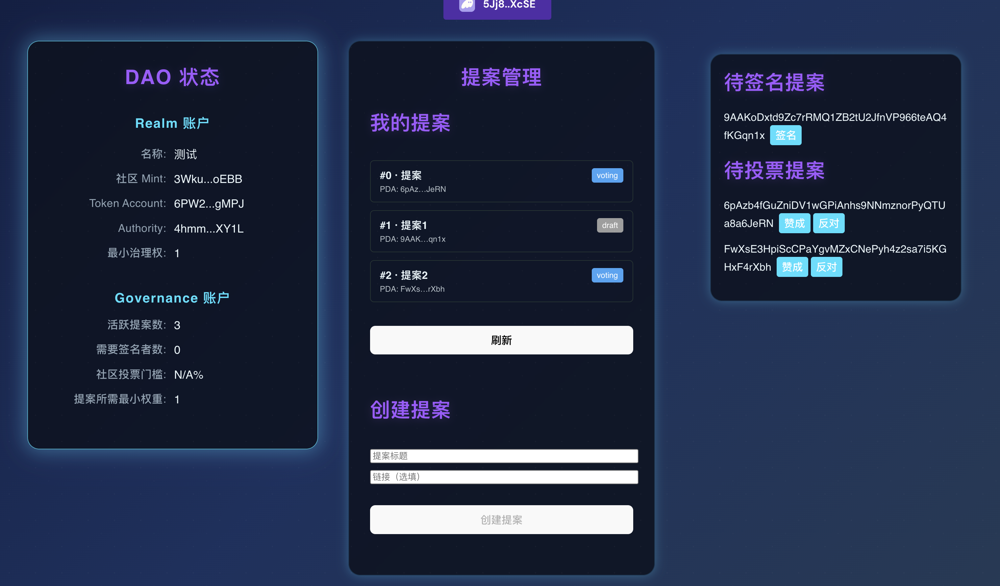

Easy DAO

一个最小可用的 Solana DAO 治理合约实现，基于 Anchor 框架编写，支持创建治理域（Realm）、提案、投票、执行链上交易等基础功能。

本项目旨在用于求职展示，模拟链上治理的完整生命周期，涵盖多账户设计、权限校验、跨合约可组合调用等核心特性。

✨ 项目亮点

🧩 完整的 DAO 治理流程：支持创建治理域、治理对象、提案、添加签名人、投票、最终执行链上交易

🔐 账户权限校验全面：基于 PDA 派生账户，严格控制权限和账户关系

🧠 逻辑结构清晰：指令按功能模块组织，状态定义和处理逻辑分离

🧪 配套测试脚本：基于 TypeScript 编写的 Anchor 测试脚本，可一键验证所有链上流程

🔄 可组合执行能力：提案支持封装任意链上指令，可执行其他程序的方法调用（如 swap）

🏗️ 功能列表

功能

说明

创建 Realm

初始化治理域，设置社区代币、参数配置

创建 Governance

绑定受治理账户（如 token mint），并设定治理规则

创建 Proposal

在治理域内创建治理提案，可添加执行指令

添加签名人

设置需要多个签名者批准的提案

签名提案

各签署人分别签名确认

投票

社区成员对提案投票（赞成/反对）

最终执行

提案通过后执行预设链上交易（如调用 AMM）

🧪 如何运行

环境准备

安装 Solana CLI

安装 Anchor CLI

Node.js ≥ 16

# 安装依赖
npm install

# 编译合约
anchor build

# 运行测试
anchor test

运行测试将自动执行以下链上流程：

创建 Realm

初始化治理对象

提交提案

添加签名人

各签名人签署

投票通过

执行链上 swap（来自另一个合约）

测试结果将在终端输出详细日志。

📁 项目结构

programs/easy_dao     # Anchor 主程序（Rust 编写）
tests/dao_test.ts     # 全流程集成测试（TypeScript）
scripts/              # 支持脚本，如生成测试交易数据

主指令集中定义在 instructions/ 文件夹内，每个文件对应一种治理操作。

🔍 技术点展示

Anchor PDA 账户设计（带种子、bump）

多账户权限组合校验（如 has_one, seeds, mut 等）

Enum 状态管理（如提案状态）

防重入设计与状态检查

对其他合约指令的解码与执行（跨合约调用）

Chain-wide 安全检查与整数溢出防御

📸 演示图

- 提案生命周期流程图
- CLI 测试运行截图
- 前端交互界面截图（如下）：

🧠 灵感与参考

本项目借鉴自 Solana 官方的 SPL Governance 实现，并作出简化以便于理解与展示。

🧳 求职者说明

作者已完成 AMM 与 DAO 两个 Solana 智能合约的项目实现，并具备 Rust、Anchor、Solana 合约开发与部署经验，欢迎联系合作或面试洽谈。

📬 联系方式

GitHub: @moonduming

邮箱/Telegram: 请在 GitHub issue 中留言

